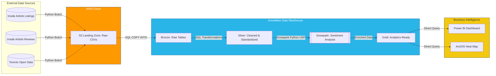
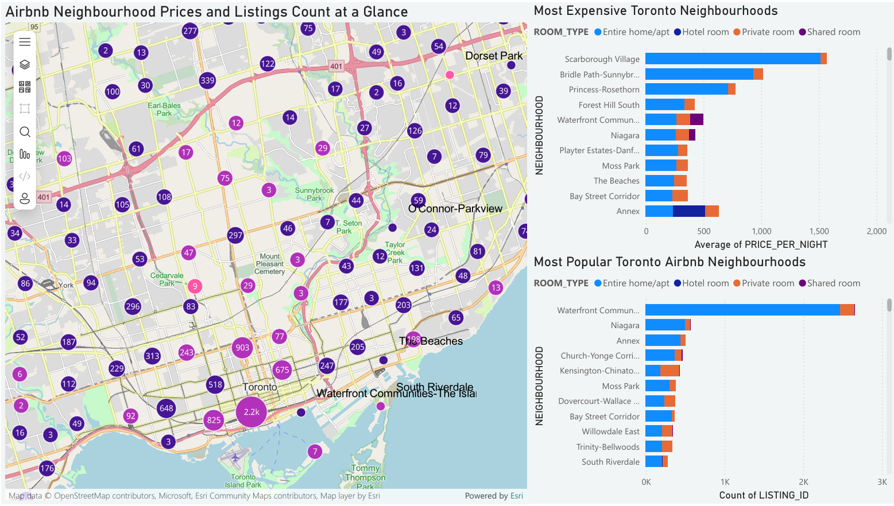

# Data Engineering Project: Toronto Airbnb ETL Pipeline

An **end-to-end ETL pipeline** for Toronto Airbnb data reporting using an S3-to-Snowflake medallion architecture.

## Overview

This project ingests Toronto Airbnb and short-term rental datasets into Amazon S3, loads them into Snowflake, and transforms them across Bronze, Silver, and Gold layers to produce analytics-ready tables for BI reporting.



Pipeline orchestration is handled with **GitHub Actions**:
- Python ingestion to S3
- Snowflake SQL transformations (Bronze/Silver)
- Snowpark sentiment analysis and final analytics-ready tables (Gold)

## Data Flow

1. **Source Data**
   - Airbnb listings and reviews data from Inside Airbnb
   - Short-term rental registrations from Toronto Open Data

2. **S3 Landing Zone**
   - Python streams source files directly into dated S3 folders

3. **Bronze Layer (Snowflake)**
   - Raw files are loaded from S3 with minimal changes

4. **Silver Layer (Snowflake)**
   - Data is cleaned, standardized, and deduplicated
   - Price and text fields are normalized
   - Review text is prepared and cleaned for sentiment analysis

5. **Gold Layer (Snowflake)**
   - Snowpark performs language detection and sentiment scoring
   - Reviews are labeled Positive, Negative, Neutral, or Non-English
   - Final reporting tables are created for BI

## Output

The final output of the ETL pipeline is an analytics-ready Snowflake Gold layer with cleaned listings, rental registration data, and review sentiment results that can be visualized with BI tools like PowerBI.



## Tech Stack

- AWS S3
- Snowflake
- GitHub Actions
- SQL
- Python
- Snowpark
- boto3, requests, pandas, python-dotenv
- vaderSentiment, langdetect
- PowerBI

## Pipeline Components & Orchestration (GitHub Actions)

The workflow runs in three sequential jobs:

1. **Ingestion**
   - `01_load_toronto_airbnb_s3.py`
   - Streams source datasets into dated folders in S3

2. **Bronze + Silver Transformations**
   - `02_bronze_ingestion.sql`
   - `03_silver_transformation.sql`
   - Loads raw S3 files into Snowflake Bronze, then cleans/transforms into Silver

3. **Gold Sentiment + BI Output**
   - `04_gold_sentiment_BI.py`
   - Uses Snowpark for sentiment analysis and builds Gold reporting tables

Workflow definition:
- `.github/workflows/airbnb_pipeline.yml`

## Snowpark Sentiment Analysis

A Snowpark UDF is used to:
- detect language (`langdetect`)
- score English reviews (`vaderSentiment`)
- classify reviews as positive, negative, or neutral to enable review type counts for each listing

This keeps processing in Snowflake and reduces unnecessary data movement.

## Compute Optimization

The pipeline was designed to use Snowflake compute efficiently:
- `AUTO_SUSPEND = 60`: the warehouse is automatically suspended after inactivity
- `AUTO_RESUME = TRUE`: the warehouse resumes only when needed
- only running sentiment analysis on new reviews to avoid reprocessing old reviews


## Setup

### Install dependencies

```bash
pip install boto3 requests pandas python-dotenv snowflake-connector-python snowflake-snowpark-python vaderSentiment langdetect
```

### Environment variables

Create a `.env` file with AWS and Snowflake credentials.

## Usage

1. Set up AWS S3 cloud storage bucket
2. Run `01_load_toronto_airbnb_s3.py`
3. Create storage integration and stage in Snowflake
4. Execute `02_bronze_ingestion.sql`
5. Execute `03_silver_transformation.sql`
6. Run `04_gold_sentiment_BI.py`
7. Connect BI tool such as PowerBI to the Snowflake gold table for analytics


## ⚖️ License & Disclaimer

### License
This project is licensed under the **MIT License** - see the [LICENSE](LICENSE) file for details. This means you are free to use, modify, and distribute this code as long as the original license and copyright notice are included.

### Disclaimer
* **For Educational Use Only:** This repository is part of a personal portfolio and is intended for educational purposes. 
* **Data Accuracy:** Analysis regarding the "unregistered" status of Airbnb listings is based on the presence/absence of license strings in the [Inside Airbnb](http://insideairbnb.com/) dataset. It does not constitute legal proof of non-compliance.
* **Liability:** The author is not responsible for any costs incurred (AWS/Snowflake), data inaccuracies, or legal actions taken based on the findings of this project. Use the provided ETL scripts at your own risk.